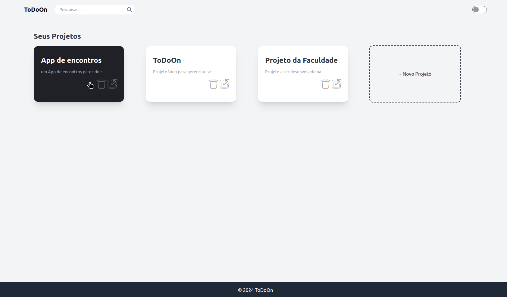
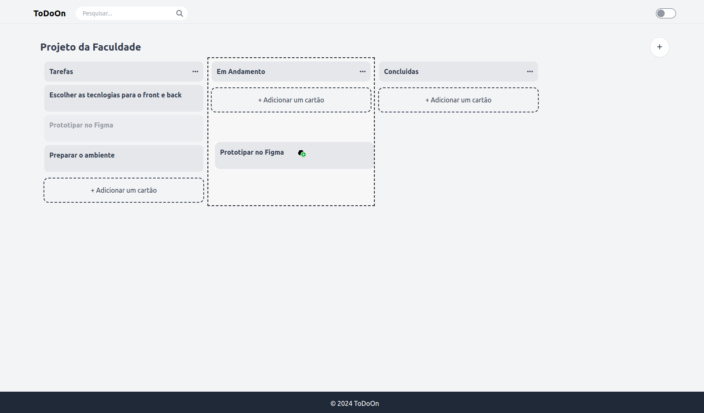

# ToDoOn

**ToDoOn** é um sistema de gerenciamento de tarefas inspirado no Trello, desenvolvido com Django e Tailwind CSS. Ele permite que usuários criem, organizem e gerenciem suas tarefas em quadros, listas e cartões, facilitando o acompanhamento e a conclusão de tarefas.





## Índice

- [Visão Geral](#visão-geral)
- [Funcionalidades](#funcionalidades)
- [Tecnologias Utilizadas](#tecnologias-utilizadas)
- [Instalação](#instalação)

## Visão Geral

ToDoOn foi desenvolvido para proporcionar uma experiência intuitiva e visual para gerenciar tarefas. Inspirado no Trello, o sistema utiliza uma interface de arrastar e soltar (drag-and-drop) para facilitar a organização de tarefas em diferentes listas e quadros.

## Funcionalidades

- **Quadros**: Crie e organize seus projetos em diferentes quadros.
- **Listas**: Adicione listas dentro dos quadros para categorizar suas tarefas.
- **Cartões**: Crie cartões dentro das listas para representar tarefas individuais.
- **Arrastar e Soltar**: Mova cartões entre listas usando uma interface drag-and-drop.
- **Etiquetas**: Adicione etiquetas coloridas aos cartões para uma rápida identificação.
- **Datas de Vencimento**: Defina prazos para suas tarefas e receba notificações de lembrete.

## Tecnologias Utilizadas

- **Backend**: Django, Django Rest Framework
- **Frontend**: Tailwind CSS
- **Banco de Dados**: PostgreSQL
- **Deploy**: Docker


## Instalação

Siga os passos abaixo para configurar o projeto localmente:

1. **Clone o repositório**:

   ```
   git clone https://github.com/seu-usuario/ToDoOn.git
   cd ToDoOn
   ```

2. **Crie e ative um ambiente virtual**:

   ```
   python3 -m venv venv
   source venv/bin/activate
   ```

3. **Instale as dependências**:
   ```
   pip install -r requirements.txt
   ```

4. **Configure o banco de dados**:

  
   * Atualize o arquivo .env com suas credenciais do banco de dados.

   * Execute as migrações
   ```
   python manage.py migrate
   ```
5. **Execute o servidor**:

   ```
   python manage.py runserver
   ```

6. **Acesse o sistema**:

   * Abra seu navegador e acesse http://localhost:8000.


